# Configuracion del OwnCloud
Una vez hemos instalado la nube de `OwnCloud` vamos a comprobar que todo funcione bien. Empezaremos con la creacion de usuarios.

## Creacion de usuarios

**1. Le damos click a la parte donde esta nuestro nombre y luego a users.**
   
 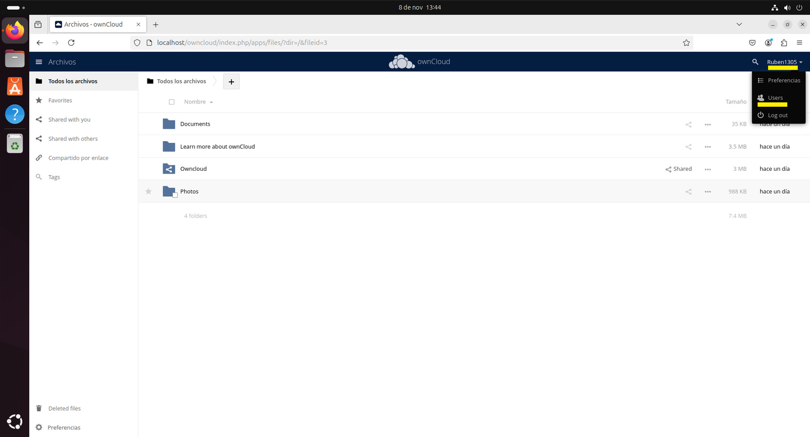
 
**2. Arriba nos saldran dos recuadros que sirven para crear un usuario en mi caso lo llamare Didac (lo puedes llamar como quieras.)**
   
 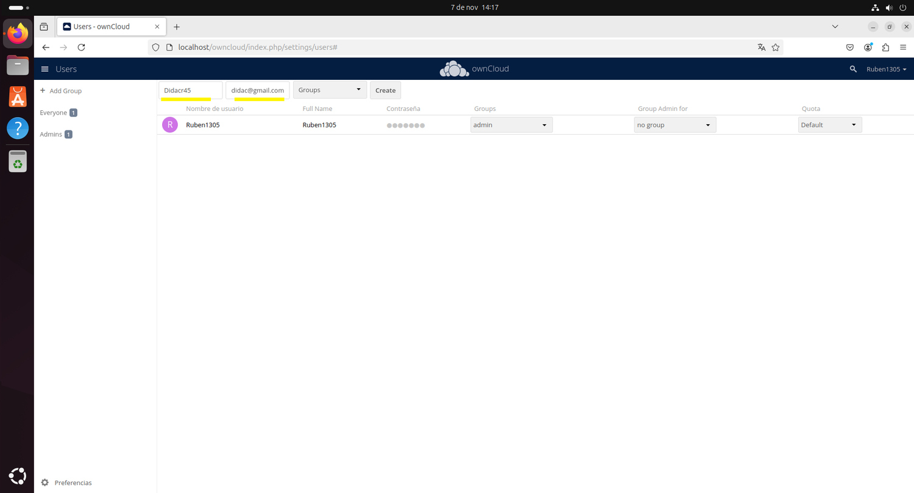
 
**3. Despues de crear el usuario le damos arriba a la izquierda en la opcion que pone add group y creamos un rol al que yo le llamare mod (tu como quieras) que le aplicaremos al usuario que hemos creado.**

 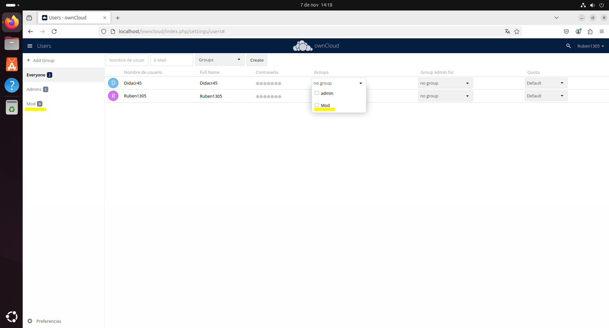
 
**4. Creamos otro usuario al que llamare Mike (lo puedes llamar como quiera).**
   
 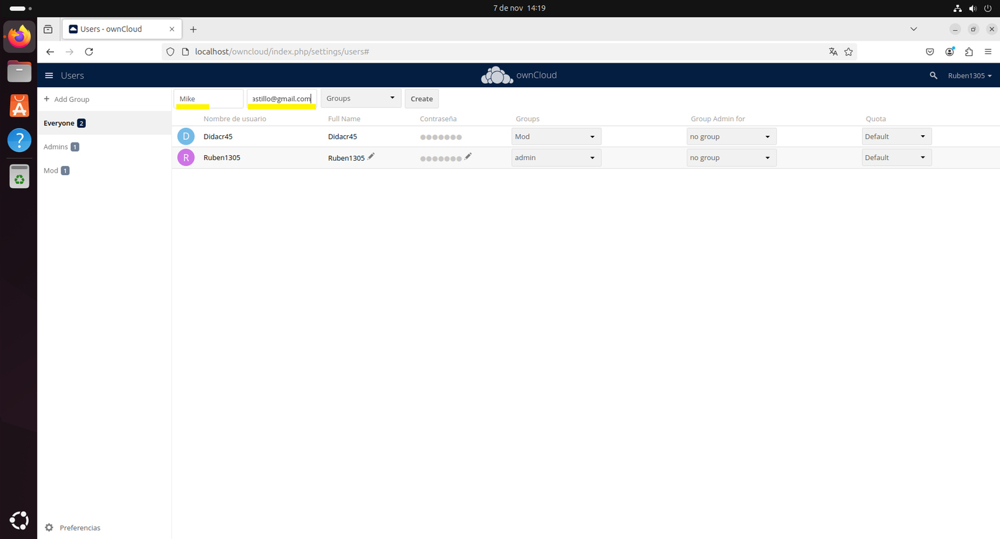
 
**5. Creamos otro grupo y se lo aplicamos al usuario que hemos creado.**

 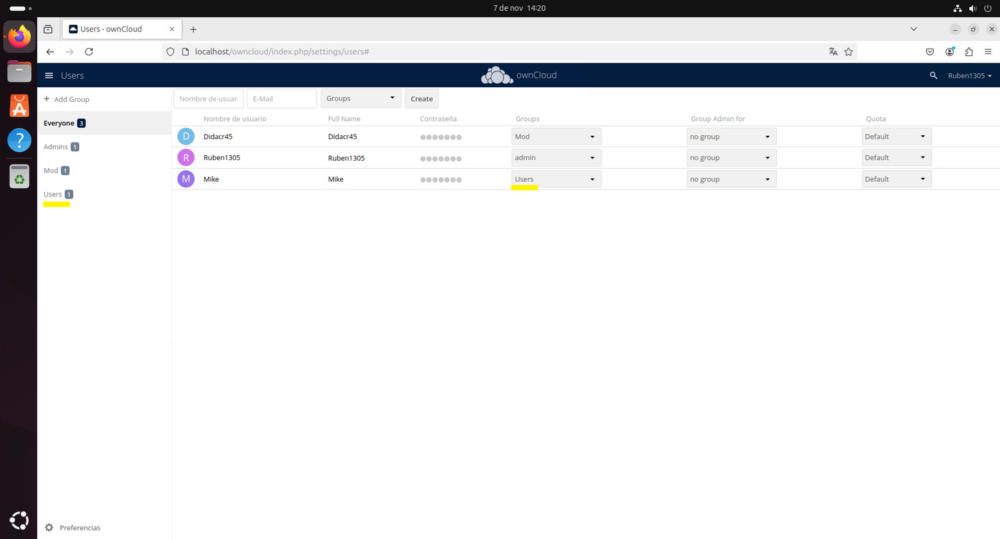

 **6. Arrastramos todas las cosas que queramos en el apartado de archivos.**
 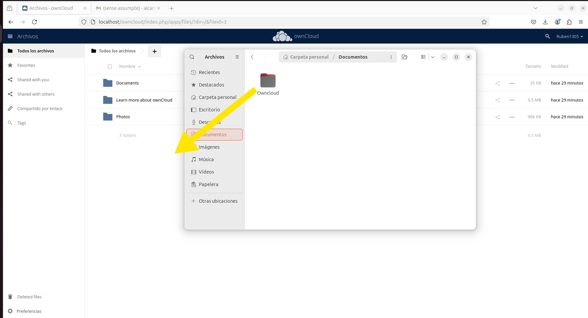

 ## Comprobamos que podamos compartir los archivos que hemos subido
**1. Una vez subido los archivos le damos a los tres puntos, a la I, se nos abrira una deplegable, le daremeos click a la opcion Sharing y seguidamente a el engranaje nos saldran unas casillas que podemos selecionar en esas elegiremos los derechos de cada rol.**

 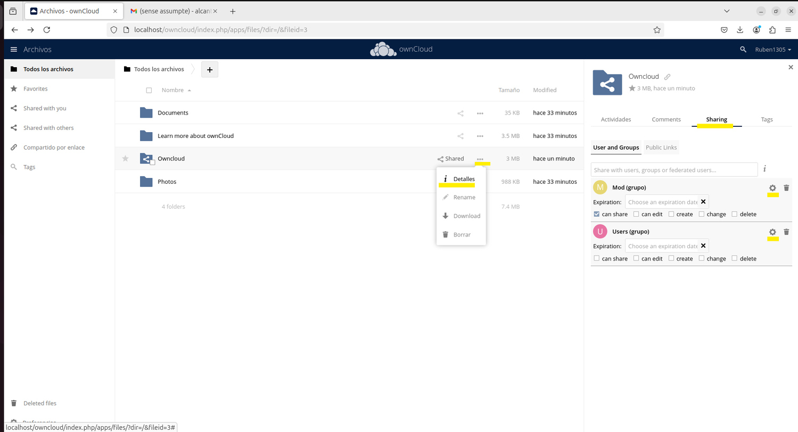

 **2.Vamos a comprobar que los poderes dados en la carpeta se puedan ver.**
 
   **2.1 Para eso el primer paso es cambiar la contraseña al usuario que hemos creado (Puedes poner una contraseña que tu quiereas pero te tienes que acordar).**
    
   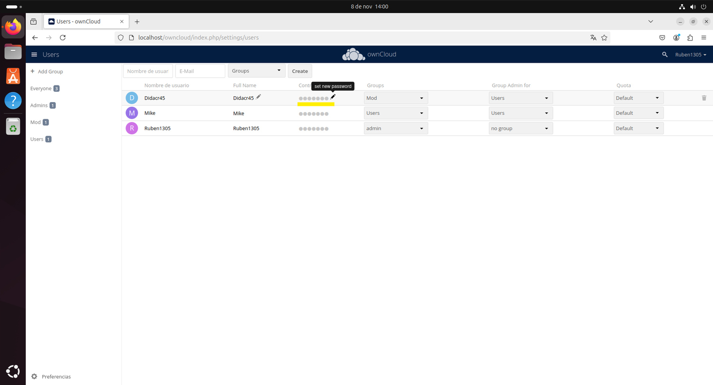

**3. Una vez cambiada la contraseña nos salimos de la cuenta del administrador.**

  

## Comprobar el uso de documentos compartidos

**1. En mi caso me meto con el usuario de Didac**

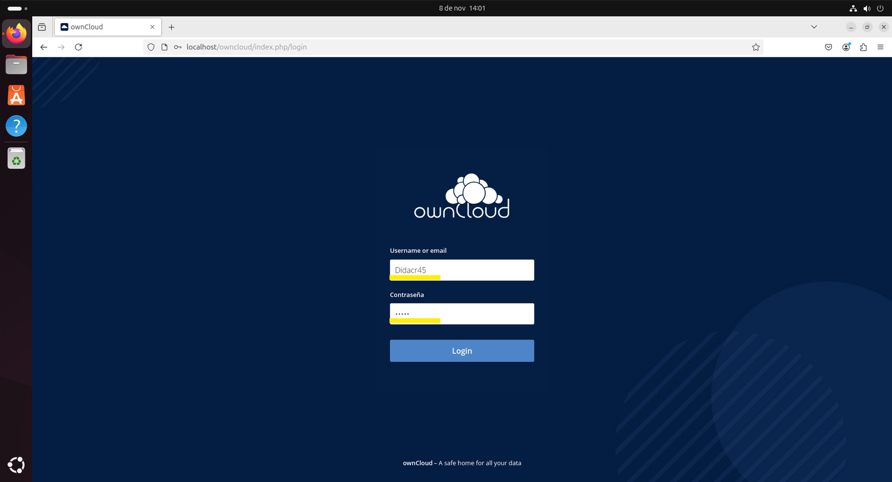

**2. Una vez dentro podemos ver que si que le sale la carpeta y tenemos acceso a ella.**

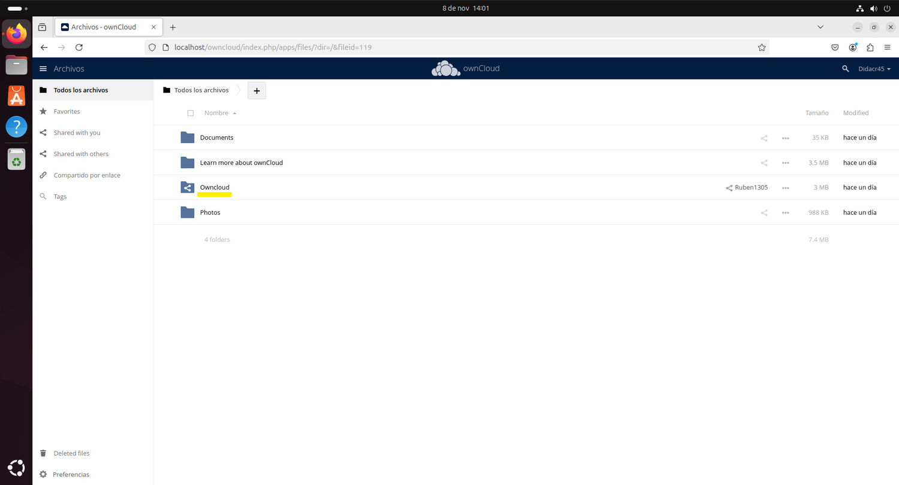

**3. Comprobamos que podamos subir para ello le damos al simbolo de mas y le damos a subidas**

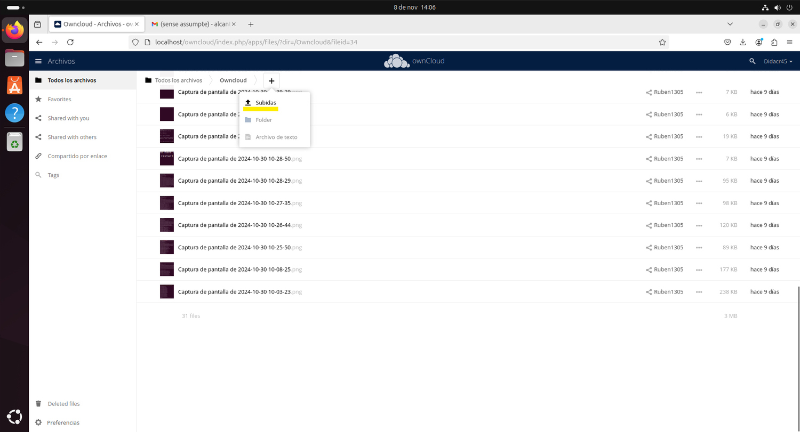

**4. Y para comprobar que si podemos subir archivos o fotos, subimos lo que queramos en mi caso mas fotos.**

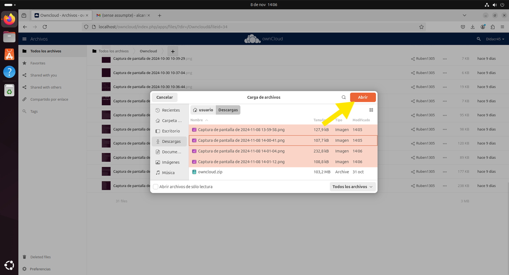

## Habilitamos el acceso a nuestra nube a una maquina remota.

**1. El primer paso sera en mi caso de una maquina virtual le tengo que cambiar la red**

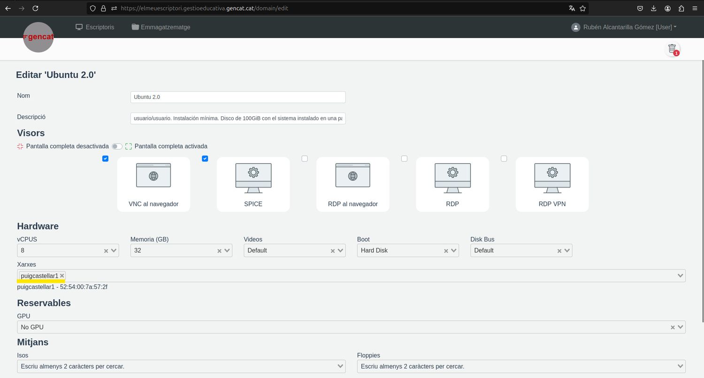

**2. Una vez hemos cambiado la red accederemos a la terminal y ejecutaremos los siguentes comandos.**
```console
cd /var/www/html/owncloud/config/
```
```console
sudo nano config.php
```
**2.1 Una vez puesto el comando anterior te pedira la contraseña de tu usuario la pones**

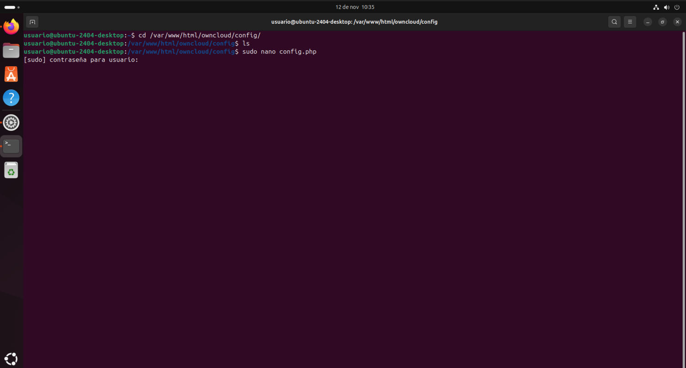

**3. Una vez puesto los comandos anteriores y la contraseña te tiene que salir algo asi**


**Donde esta puesta la linia amarilla hay que poner TU ip (la de tu maquina/WIFI)**
