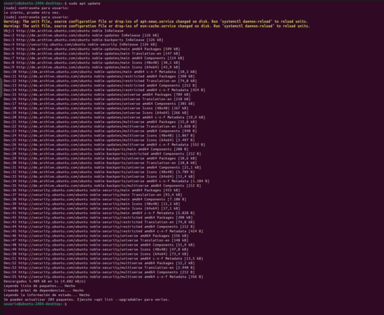

# OwnCloud
Instal·larem el núvol OwnCloud des de la terminal en un programari Linux.
## Primer paso Instal·lació d'apache2, mysql i algunes llibreries al contenidor
Abans de fer aixo el que farem sera actualitzar la maquina.
Amb l'us del comandament 

**sudo apt update**
Aixo es el que te que surtir al executar el comandament

Una vegada executat aquest comandament farem aquest altre 

**sudo apt upgrade**
