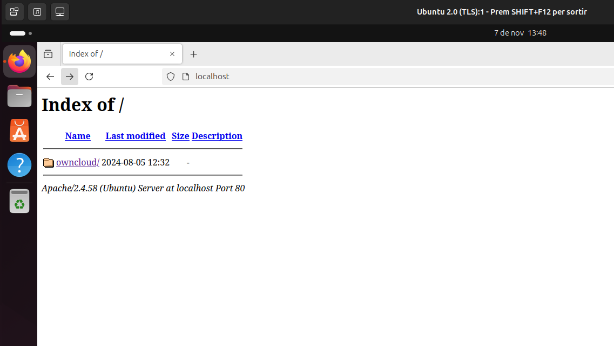
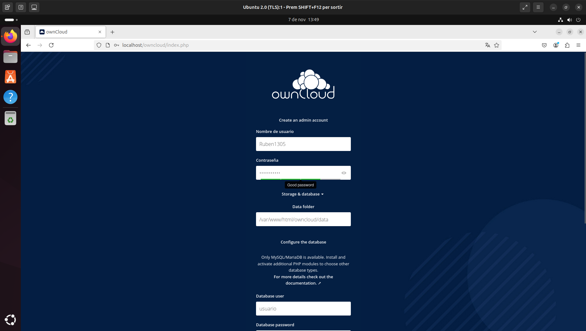
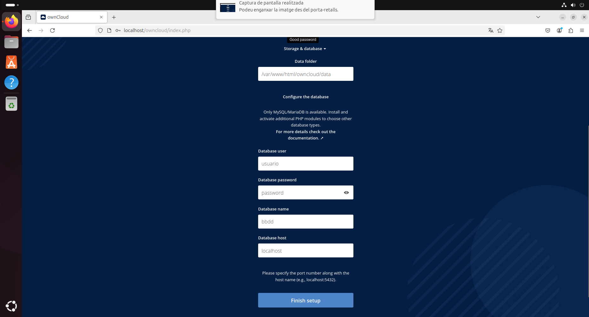

# OwnCloud
Instalaremos la nube de OwnCloud con la terminal en un sistema Linux.
## Primer paso Instalacion del apache2, mysql y  otras librerias al directorio.
Antes de hacer eso lo que hacemos es actualizar la maquina.
Con este comando la actualizamos.
```console
sudo apt update
```
1. Una vez ejecutado este comando utilizaremos este otro. 

```console
sudo apt upgrade
```
2. Una vez ejecutados los dos comandos siguientes ya tenemos la maquina actulizada y vamos a instalar **apache2 i mysql** con estos comandos.   
```console
sudo apt install -y apache2**
```
```console
sudo apt install -y mysql-server
```

4. Ahora ja tenemos las aplicaciones instaladas, asi que vamos a por las librerias. 
```console
sudo apt install -y php libapache2-mod-php
```
```console
sudo apt install -y php-fpm php-common php-mbstring php-xmlrpc php-soap php-gd php-xml php-intl php-mysql php-cli php-ldap php-zip php-curl
```
5. Una vez instalada las aplicaiones y librerias reiniciamos el servidor de apache2.

```console
sudo systemctl restart apache2
```
## Instalarr la version 7.4 de PHP a Ubuntu 24.04

1. Para poder instalar OwnCloud neccesitamos la version 7.4 de PHP, para instalar en nuestro sistema tendremos que ejecutar los comandos siguientes.
2. Instalamos los requesitos previos de PPA:

```console
sudo apt install software-properties-common -y
```
3. Instalamos las herramientas neccesarias para trabajar con los archivos de paquetes personales (PPA).

```console
LC_ALL=C.UTF-8 sudo add-apt-repository ppa:ondrej/php -y
```
4. Actulizamos los repositorios.
```console
sudo apt update
```
5. Una vez actualizado el repositorio instalamos las librerias de PHP 7.4.
```console
sudo apt install php7.4 -y
```
```console
sudo apt install -y php libapache2-mod-php7.4
```
```console
sudo apt install -y php7.4-fpm php7.4-common php7.4-mbstring php7.4-xmlrpc php7.4-soap php7.4-gd php7.4-xml php7.4-intl php7.4-mysql php7.4-cli php7.4-ldap php7.4-zip php7.4-curl
```
6. Una vez hemos instalado las librerias elegimos la version que queramos de PHP
```console
sudo update-alternatives --config php
```
7. Ahora es el momento de activar los modulos de apache2.
```console
sudo a2enmod proxy_fcgi setenvif
```
```console
sudo a2enconf php7.4-fpm
```
8. Por ultimo actualizaremos apache2
```console
sudo service apache2 restart
```
## Configurem el MYSQL

1. Lo primero es acceder al **MYSQL**.
```console
sudo mysql
```
2. Una vez dentro de **MYSQL** creamos la base de datos a la que le pondremos de nombre bbdd.
```console
CREATE DATABASE bbdd;
```
3. Con la base de datos creada, creamos el usuario.
```console
CREATE USER 'usuario'@'localhost' IDENTIFIED WITH mysql_native_password BY 'password';
```
4. Ahora le damos permisos
```console
GRANT ALL ON bbdd.* to 'usuario'@'localhost';
```
5. Ya hemos echo todo dentro del **MYSQL** a si que salimos.
```console
exit
```
6. Una vez ja fuera del **MYSQL** lo que haremos sera probar la conexion con la base de datos.
```console
mysql -u usuario -p
```

## Descarreguem els fitxers de l'aplicació web
1. Este es el archivo que os teneis que descargar.
https://download.owncloud.com/server/stable/owncloud-complete-20240724.zip
2. Vamos al directorio de descargas.
```console
cd Baixades
```
3. Una vez dentro del directorio descomprimimos aqui los archivos, teneis que cambiar `app-web.zip` por el nombre de vuestro archivo.
   
```console
sudo cp ~/Baixades/app-web.zip /var/www/html
```
4. Vamos al directorio `/var/www/html`

```console
cd /var/www/html
```
5. Copiamos los archivos en la carpeta `/var/www/html`, cambia `app-web` por el nombre del directorio donde se ha descomprimido su archivo.

```console
sudo cp -R app-web/. /var/www/html
```

6. Descomprimimos el archivo hay que recordar que hay que sustituir `app-web.zip` por el nombre de su archivo.

```console
sudo unzip app-web.zip
```
7. Una vez hemos descomprimido el `.zip` utilizamos este comando para eliminarlo. Recordemos que el nombre de `app-web` se debe cambiar por el nombre de su archivo.

```console
sudo rm app-web.zip
```
8. Una vez eliminado el `.zip` también eliminamos el `index.html`.
   
```console
sudo rm -rf /var/www/html/index.html
```
## Aplicación de poderes en nuestras aplicaciones webs

1. Una vez hemos descomprimido todos los archivos en el directorio `/var/www/html` le daremos los permisos a este directorio.
   
2. Si no estamos dentro del directorio ya ejecutaremos este comando.
```console
cd /var/www/html
```
3. Una vez dentro del directorio ejecutaremos los comandos siguientes.
```console
sudo chmod -R 775 .
```
```console
sudo chown -R usuario:www-data .
```
## Registrarse a l'OwnCloud

1. Una vez hemos hecho todo vamos al navegador en mi caso Firefox y buscar `localhost` nos saldrá algo así.



2. Le damos a la opcion que sale resalta en azul y nos saldrá una pagina como esta.

 

3. En las dos primeras opciones ponemos un nombre de usuario y una contraseña de los que nos acordaremos.
   
  

4. Más abajo en estas opciones pondremos lo siguiente.

  


**Los datos que hay que poner son éstos**

**Usuario:** usuario
**Contraseña:** password
**Base de datos:** bbdd
**Dominio:** localhost

**En este enlace podras ver el manual de configuracion de OwnCloud [Configuracion](https://github.com/Ruben1305/OwnCloud-/blob/main/Configuraci%C3%B3%20del%20OwnCloud.md)**

 
